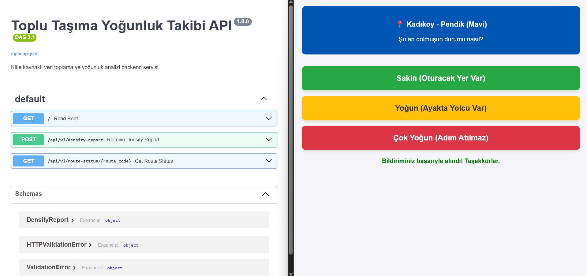

# toplu-tasima-yogunluk-tespiti-uygulamasi
##Ekip Arkadaşları:
  Görkem Hacıoğlu
  Hülya Cerit
  -Diğer arkadaşlarımıza ulaşamadık
## Proje Künyesi

**Takım İsmi:** RotaTech Ekibi

**Takım Rolleri:**
*   **Product Owner:** Görkem Hacıoğlu
*   **Scrum Master:** Hülya Cerit

**Ürün İsmi:** RotaRadar

**Ürün Açıklaması:**
RotaRadar, kitle kaynaklı (crowdsourced) veri toplama modeliyle çalışan, toplu taşıma araçlarındaki (özellikle durağı olmayan dolmuş ve minibüs hatlarındaki) anlık yolcu yoğunluğunu tespit eden bir web uygulamasıdır. Yolcuların araç içinden yaptığı anonim bildirimleri analiz ederek, durakta bekleyen diğer kullanıcılar için gerçek zamanlı bir yoğunluk haritası sunmayı amaçlar.

**Ürün Özellikleri:**
*   **Hızlı Veri Girişi:** Yolcuların hareket halindeki bir araç içinde bile tek tıkla durum (Sakin, Yoğun, Çok Yoğun) bildirebilmesini sağlayan minimalist arayüz.
*   **Gerçek Zamanlı Dinamik Analiz:** Sistemin güncel kalması için yalnızca son 15 dakika içinde girilen verilerin matematiksel ortalamasını alarak nihai bir yoğunluk skoru üretme.
*   **Anti-Spam Koruması:** Asılsız veri akışını ve manipülasyonu engellemek amacıyla, aynı kullanıcının (cihazın) 5 dakika içinde birden fazla bildirim yapmasını engelleyen güvenlik algoritması.
*   **Lokasyon Doğrulaması (Geliştirme Aşamasında):** Kullanıcıların yalnızca fiziksel olarak bulundukları koordinatlarla eşleşen hatlar için bildirim yapabilmesini sağlayan GPS entegrasyonu.

**Hedef Kitle:**
*   Günlük iş veya okul güzergahında dolmuş, minibüs ve otobüs gibi toplu taşıma araçlarını aktif olarak kullanan şehir içi yolcular.
*   Zaman yönetimine önem veren ve dolu bir aracı beklemek yerine alternatif güzergahlar (veya farklı ulaşım yolları) planlamak isteyen bireyler.

## Product Backlog (Ürün İş Listesi)
*   ✅ Kullanıcıların yoğunluk durumunu saniyeler içinde seçebileceği mobil uyumlu web arayüzünün (UI) tasarlanması.
*   ✅ FastAPI kullanılarak backend iskeletinin, Pydantic modellerinin ve API uç noktalarının (endpoints) oluşturulması.
*   ✅ Sistemin tutarlılığı için Zaman Filtresi (Son 15 dk) ve Spam Filtresi (5 dk bekleme) algoritmalarının koda entegre edilmesi.
*   ⏳ HTML5 Geolocation API kullanılarak kullanıcı cihazından anlık enlem/boylam verisinin alınması ve backend'e iletilmesi.
*   ⏳ Toplanan verilerin sonucunun (hattın güncel durumunun) yolculara gösterileceği harita veya durum ekranının tasarlanması.
*   ⏳ Kalıcı veri depolama ve mekansal (spatial) analizler için PostgreSQL/PostGIS veritabanı entegrasyonunun sağlanması.

---

## Sprint 1 Raporu ve Çevik Yönetim (Agile/Scrum)

### Backlog Düzeni ve Story Seçimleri
İlk sprint için odak noktamız MVP'nin (Minimum Viable Product) kalbi olan "Kullanıcı Giriş Katmanı (Data Ingestion)" olarak belirlenmiştir. Bu kapsamda seçilen User Story'ler şunlardır:
*   **Story 1:** Kullanıcıların dolmuş içindeyken yoğunluk durumunu saniyeler içinde seçebileceği mobil uyumlu bir arayüz tasarlanması.
*   **Story 2:** FastAPI ile kullanıcılardan gelen JSON verilerini karşılayacak backend uç noktalarının oluşturulması.
*   **Story 3:** Sistemi manipülasyonlardan korumak için 5 dakikalık "Spam Filtresi" mantığının koda entegre edilmesi.

### Daily Scrum (Günlük Toplantılar)
*   **İletişim:** Planlamalar Slack üzerinden sağlanmıştır.
*   **Çözülen Engeller:** Frontend ve Backend'in farklı portlarda çalışmasından kaynaklı CORS (Cross-Origin Resource Sharing) hataları gün içindeki değerlendirmelerle çözülmüş ve veri akışı sağlanmıştır.

### Sprint Board (Pano)
Takımımızın iş bölümünü ve görev durumlarını (Idea, To Do, In Progress, Done) takip ettiği sprint panosunun güncel hali:

### 4. Ürün Durumu (Mevcut Çalışan Sürüm)
İlk sprintin sonunda ortaya çıkan, API ile haberleşen kullanıcı arayüzü ve Swagger test ortamı:

### 5. Sprint Review (Sprint Değerlendirmesi)
*   **Tamamlananlar:** FastAPI iskeleti kuruldu, Pydantic modelleri hazırlandı. Spam filtresi eklendi ve HTML/JS tabanlı arayüz başarılı bir şekilde sunucuya veri gönderebilir hale getirildi.
*   **Eksikler/Ertelenenler:** Kullanıcının gerçek konumunu (GPS koordinatları) tarayıcıdan HTML5 Geolocation API ile çekme işlemi teknik araştırma gerektirdiği için bir sonraki sprinte aktarıldı.

### 6. Sprint Retrospective (Geçmişe Dönük Analiz)
*   **İyi Gidenler:** Takım içi GitHub Git Flow sürecinin pürüzsüz işlemesi ve backend mantığının (Zaman/Spam filtreleri) planlanandan daha hızlı koda dökülmesi.
*   **Geliştirilmesi Gerekenler:** Projeye başlarken IDE (Cursor/PyCharm) ve terminal entegrasyonlarında yaşanan vakit kayıplarını önlemek için ilerleyen aşamalarda ortam kurulumlarının daha hızlı stabilize edilmesi.

*   d
*   Daily scrum ss
*   (image/IMG-20260706-WA0000.jpg)
*   
